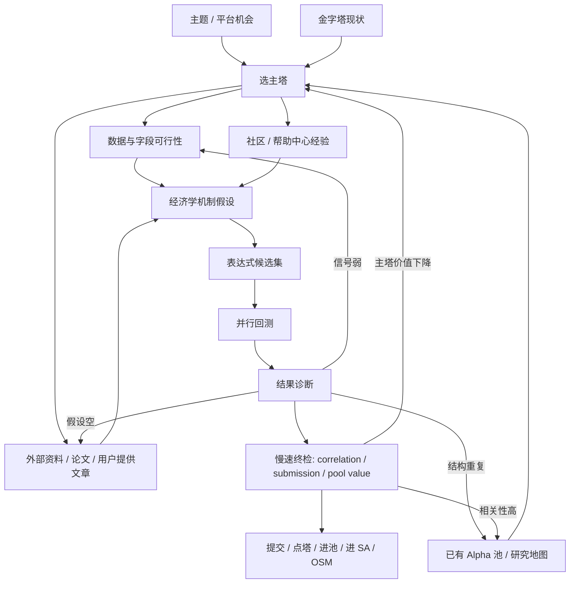
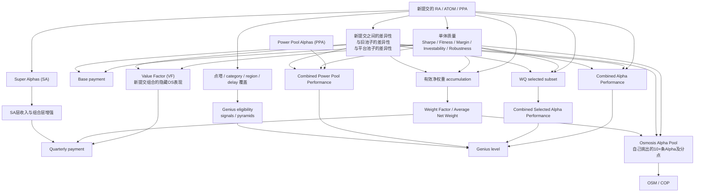

# BRAIN 研究学习笔记

写作时间：2026-05-05
数据基础：`wqb_core/dataset/forum/community.sqlite3`
数据快照：`wqb_core/dataset/forum/WQPCommunityState_20260505_141911.json`

这份笔记不是平台官方文档的复述，也不是论坛经验帖的简单摘抄。
它的目标是把当前本地缓存中的帮助中心规则、顾问专属中文论坛经验、Global Consultant 社区经验，整理成一份可以直接指导研究决策和研究执行的工作文档。

阅读时请始终区分三层信息：

1. `官方定义`
来自帮助中心 FAQ / 规则页。
2. `社区经验`
来自顾问专属中文论坛、Global Consultant 社区、中文论坛等帖子和高赞评论。
3. `我的归纳`
在官方规则和社区经验之上，为了研究执行而做的工作化总结。

另外，文中我会区分两个说法：

- `pyramid`
  这是平台官方术语。
- `塔`
  这是为了研究执行方便而采用的工作化简称。

除非特别说明，文中的“塔”都等同于平台官方所说的 `pyramid`。

---

## 0. 当前学习范围与高信号来源

本次重点参考了以下类型的内容：

1. 帮助中心规则
包括：
- `How do I qualify for the higher levels?`
- `What are pyramids?`
- `What is Combined Alpha Performance?`
- `What is the Value Factor?`
- `How can you earn more Base payment?`
- `How can you earn more Quarterly Payment?`
- `How do Power Pool Alphas affect compensation?`
- `Factors to consider while assigning Osmosis points`
- `Competition flow and scoring criteria`

2. 顾问专属中文论坛高信号帖子
包括：
- `【新人科普，老人必读】最全Product Correlation攻略，理解PC与顾问收入的密切关系`
- `【新人科普，老人必读】从Combined Alpha Performance 的计算原理，学习如何提升表现！`
- `【经验分享】冲刺 genius！+ 细节决定成-败，你的六维还能提升！+ 点塔！+ alpha模板`
- `从Gold跃升到GrandMaster——选好模板和相关性剪枝可能是关键`
- `日赚90刀💵作为新人，我是怎么样从value factor 0.5升到0.99的？`
- `04.【永久置顶】高Value Factor顾问分享合集，赚钱必读！(更新1029）`
- `【Eligibility Criteria篇】一文告诉你如何GOLD直通Grandmaster！（上篇）`
- `【开箱即用,断点续传】稳定产出 own 三五SA 架构`
- `🚀【必读】SuperAlpha 入门手册`

3. Global Consultant Community for Staying Ahead 高信号帖子
包括：
- `Value factor & weight factor`
- `Achieving a Value Factor of 0.98: Lessons Learned and Advice for Consultants`
- `BRAIN Genius: Improving Combined Alpha Performance`
- `How to reduce operator per alpha in Genius Program`
- `Clarification on Tie-Breaker Criteria`
- `How I reached Grandmaster in Q4...`
- `How to increase weight factor effectively`
- `The alpha weighting strategy in Osmosis`
- `When does the first Osmosis combined score COP get its first update?`
- `DIVERSIFICATION OF ALPHAs`

---

## 1. 我们的目的是什么

### 1.1 不是“做出一个好看的 Alpha”

如果只从单条 Alpha 的视角看问题，很容易把目标理解错。
平台真正奖励的不是“偶尔出现的一条高 Sharpe 因子”，而是持续为平台和自己的池子提供有边际价值的一组 Alpha。

我的归纳是：

`我们的终极目标 = 持续产出一组可提交、低相关、多样化、对组合有价值、能提升收入和等级的 Alpha 池。`

这比“做出一个高 Sharpe Alpha”更接近真实目标。

### 1.2 目标至少有四层

#### 第一层：生存目标

先稳定产生可以提交、不过度过拟合、不过度重复的 Alpha。
这决定：
- 能不能持续提交
- 能不能稳定拿 base payment
- 能不能开始积累 VF / WF / combine / pyramids

#### 第二层：收入目标

不是单纯多交，而是让新增提交：
- 增加 base payment
- 增加 quarterly payment
- 提升 VF
- 提升 WF

#### 第三层：等级目标

通过：
- 足够的 signals
- 足够的 pyramids
- 足够的 Combined Alpha Performance
- 更优的 tie-breakers

进入更高的 Genius level，例如 Expert / Master / Grandmaster。

#### 第四层：组合目标

最终拼的不是单 Alpha，而是：
- Alpha 组合的 out-of-sample 表现
- Alpha 对自己池子的边际贡献
- Alpha 对 Power Pool / Super Alpha / Osmosis / competitions 的边际贡献

这一步才真正决定长期上限。

### 1.3 所以我们真正追求的不是“最强单点”，而是“高质量生产线”

从论坛经验看，真正走得远的人有一个共同点：

- 不是单次灵感更强
- 而是研究生产线更稳
- 候选筛选更强
- 相关性剪枝更有效
- Alpha 池管理更成熟

我的归纳：

`研究能力的核心，不是造一个式子，而是持续产出有组合价值的新式子。`

---

## 2. 怎么达到这些目标

这一节分开谈：

1. 高 VF
2. 高 WF
3. 变成 GM
4. 高 OSM
5. 高 combine
6. 高 OS

---

### 2.1 高 VF

#### 官方定义

帮助中心 `What is the Value Factor?` 的核心定义是：

- VF 反映最近提交的 Alpha 组合的表现
- 关注三件事：
  - 单个 Alpha 的表现
  - 最近提交之间的多样性
  - 相对于自己过去提交和其他顾问提交的独特性
- 本质上是“你最近新提交的 Alpha 组合在隐藏 OS 上表现如何”
- VF 同时影响：
  - Base payment
  - Quarterly payment

帮助中心 `Does number of alpha submissions per month impact value factor?` 还给了一个非常重要的硬约束：

- VF 使用 3 个月滚动窗口
- 如果滚动 3 个月里提交天数少于 20 天，VF 会重置到最低值

#### 社区经验

顾问专属中文论坛和 Global Consultant 社区对高 VF 的经验高度一致：

1. `数量、质量、分散性` 三者都重要
2. 高 VF 不是单纯多交，而是“多交高质量且不重复的 Alpha”
3. 低相关性和独特性非常关键
4. 不要为了过相关性检测硬插噪声表达式
5. 要更重视：
   - margin
   - fitness
   - turnover
   - sub/super universe 稳健性

有些社区经验还给出了很实用但非官方的外部判断法：

- 看 regular base pay 是否足够高
- 用第二天的 base 变化粗判提交质量

这不是平台规则，但在实操中是有用的早期信号。

#### 我的归纳

高 VF 的本质不是“单条最强”，而是：

`你本季度新增 Alpha 的组合，在隐藏 OS 上是否既好又新。`

因此，要提高 VF，优先级应该是：

1. 提高新提交 Alpha 的单体质量
2. 提高新提交之间的差异性
3. 提高相对旧池子和平台池子的独特性
4. 保证滚动窗口活跃度，不断档

#### 实操建议

1. 保证滚动 3 个月里至少 20 天有提交
2. 候选筛选优先看：
   - investability 后 Sharpe 保留度
   - turnover
   - margin
   - robust universe / subuniverse
3. 当前塔位已用过的 datafield 不再优先重复用
4. 不在单个模板上耗太久，先扩搜索广度，再做局部加深
5. 新提交尽量：
   - 低 product correlation
   - 低 self correlation
   - 低与自己池子的逻辑重合

---

### 2.2 高 WF

#### 官方定义

当前本地帮助中心没有直接找到名为 `What is the Weight Factor?` 的独立解释页，但从几篇文档可以基本还原它的意义。

1. `How can some consultants have high weight but fewer alphas on the Consultant leaderboard?`
   - weight 不只取决于 Alpha 数量
   - 也取决于 Alpha 的 OS 表现
   - 一些 `OS-pending` 的 Alpha 也可能获得 weight

2. `How can you earn more Quarterly Payment?`
   - quarterly payment 的一个核心组件是：
     `Average Net Weight in the Quarter on ALL your Alphas`
   - 提升它的方法包括：
     - 提交更多 Alpha
     - 至少 20 个不同的提交日
     - 使用高 value score 的 dataset
     - 在 multiplier theme 中提交
   - 但文档也明确说：
     - 不是数量 alone
     - `Unique, high performing Alphas are more likely to get weight`

3. `What is the compensation for SuperAlpha?`
   - quarterly payment 中，weight 是在 `Alpha + SuperAlpha` 两层上共同累积的
   - 这说明 weight 不是只看 regular alpha

因此，更准确的理解是：

- WF 不是“我有多少条 Alpha”的函数
- 而是“我整季 Alpha 与 SuperAlpha 池获得了多少有效净权重”的函数
- 这个权重既和数量有关，也和 OS 质量、独特性、能否被赋权有关

#### 社区经验

围绕 WF 的社区经验主要集中在这些方向：

1. 提高组合层权重，不是只多交，而是多交 `OS 表现好且 unique` 的 Alpha
2. 高 value score dataset 和主题加成会有帮助
3. Super Alpha 和高质量组合选择会帮助提升 selected / combined 相关表现，进而帮助 weight
4. 只堆很多低质量、同质化 Alpha，往往对 WF 帮助有限

#### 我的归纳

WF 更像“市场/平台愿意给你当前 Alpha 池多大有效净权重”的结果变量。

因此，高 WF 的方向不是：

- 把同类 Alpha 越交越多

而是：

- 让提交池里有更多真正值得被赋权的 Alpha

#### 实操建议

1. 维持持续提交节奏
2. 提高每条新增 Alpha 的 OS 质量
3. 优先保留：
   - unique
   - high-performing
   - low-correlation
   - simple but useful
   的候选
4. 可以适度利用：
   - theme multiplier
   - high value score dataset
   - Power Pool / Super Alpha 组合优势

---

## 2.2.1 四类 Alpha: RA / SA / PPA / ATOM

这一节是对后续所有研究工作的一个基础约定。
很多论坛帖子默认已经区分这四类，但如果一开始没理解清楚，会直接影响：

- 该做什么研究
- 该投什么目标
- 该怎么点塔
- 该怎么提升 VF / WF / combine / OSM / GM

### RA: Regular Alpha

#### 社区定义

顾问专属中文论坛 `【新人科普】BRAIN 平台上的四类Alpha（RA, ATOM, PPAC, SA）` 对 RA 的概括是：

- Regular Alpha 是最基础、最自由、也最严格的一类
- 表达式在字段和操作符总量不超过常规限制时可提交
- 需要通过平台完整的常规检测标准

帖子里强调的检查包括：
- IS ladder
- sub-universe
- weight concentration
- product correlation

#### 我的理解

RA 是“平台的标准常规 alpha”。

它的特点是：
- 自由度最高
- 约束也最完整
- 更适合承载复杂一些、机制完整一些的研究

它通常是：
- 研究能力的主战场
- 常规收入和长期池子建设的主力层

### ATOM Alpha

#### 官方定义

帮助中心 `What are the weekly categories during Super Alpha Competition (SAC) 2025?` 中对 `ATOM Alphas` 的定义是：

- 单数据集 Alpha
- 单 dataset 创建
- relaxed submission checks
- 预期 Sharpe 要求约为 `1.58`
- IS ladder 更宽松

论坛帖子也给出一致解释：

- 所有主要 datafield 来自同一个 dataset
- 常见 grouping fields 例如 `country / industry / subindustry / exchange / currency / market / sector` 不算作额外 dataset

#### 我的理解

ATOM 的本质不是“更简单”，而是“更纯”。

它通常更适合：
- 保持信号单一性
- 降低混信号风险
- 让 OS 更稳
- 做更干净的模板扩展

在研究上，ATOM 很适合：
- 做字段探索
- 做原子模板
- 做高纯度候选库

### PPA / PPAC / Power Pool Alpha

文中我统一写作 `PPA`，指 `Power Pool Alpha`。
论坛里也常写成 `PPAC alpha`，本质上是同一类语境下的称呼。

#### 官方定义

帮助中心 `Which Alphas are eligible for Power Pool Alphas Thematic Competition?` 和相关 PPAC 文档给出了一组非常关键的规则：

- pure Power Pool alpha 必须匹配至少一个 active Power Pool theme
- `Sharpe >= 1.0`
- `total operators <= 8`
- `unique data fields <= 3`，不含 grouping fields
- self-correlation among your Power Pool alphas 要足够低，或者 Sharpe 高出被比较对象 10%
- turnover 在 `1% ~ 70%`
- 通过 sub-universe check
- exempt from:
  - prod correlation
  - pool 外自相关
  - fitness threshold
  - IS ladder

帮助中心 `How do Power Pool Alphas affect compensation?` 还明确说：

- PPA 会计入：
  - base payment
  - VF
  - weight
  - combined alpha performance
  - Genius eligibility 与 tie-breakers
- 单体 PPA 可能不如 regular alpha 强
- 但简单、分散、低相关的 PPA 组合常常能显著提升 VF 和 combine

#### 社区定义

论坛通常把 PPA 理解成：

- 更简单
- 更宽松
- 更强调低自相关和 pool 内多样性

#### 我的理解

PPA 不是“低配 Regular Alpha”，而是“为组合价值而设计的简单 alpha 轨道”。

这类 alpha 的关键不在于单体最强，而在于：
- 结构简单
- 字段少
- 操作符少
- 自相关低
- 组合性强

对当前研究目标来说，PPA 往往非常适合：
- 点塔
- 提高 VF
- 提高 combine
- 做 OSM 备选池
- 做简单、可扩展的候选库

### SA: Super Alpha

#### 官方定义

帮助中心 `What is the compensation for SuperAlpha?` 给出两个关键点：

1. `Base payment`
   - SA 和 Alpha 使用相同 base payment 方法
   - 但 money pool 分开
   - 所以同时做 Alpha 和 SA 有助于提高总日收入

2. `Quarterly payment`
   - weight 在 Alpha 与 SA 两层合并计算
   - value factor 由 Alpha 与 SA 两层表现共同决定，如果两层都存在，则等权贡献

帮助中心 `What SuperAlpha accesses are visible to higher levels?` 还说明：

- 任何 consultant，达到 `100` 个 Alpha 提交后，可以创建 SuperAlpha
- 更高 Genius level 可以访问更大的 child alpha 池

#### 社区定义

论坛通常把 SA 理解成：

- 组合层能力
- 不是单个字段研究，而是对子 Alpha 池的再加工
- 如果 regular alpha 池本身够好，SA 才更容易做得好

#### 我的理解

SA 是“alpha 组合优化层”，不是“regular alpha 的替代品”。

它的价值主要在于：
- 叠加一层独立收入池
- 叠加一层组合优化能力
- 提高 quarterly payment
- 提高 WF / VF 的上限

所以 SA 的正确时机不是最早期，而是：
- 当你已经有一批质量不错、风格多样、低相关的 child alpha
- 再去做组合、筛选、加权

### 四类 Alpha 的分工

我的归纳如下：

1. `RA`
   - 常规主战场
   - 自由度高
   - 用于完整机制研究和主力提交

2. `ATOM`
   - 原子化、纯净
   - 用于高纯度字段研究和单 dataset 模板

3. `PPA`
   - 简单、宽松、强调低自相关
   - 用于点塔、组合补充、VF/combine/OSM 友好方向

4. `SA`
   - 组合层优化
   - 依赖已有 Alpha 池质量
   - 用于扩大收入层和组合层收益

因此，研究上不应该问：

`哪类 alpha 最好？`

而应该问：

`我当前的研究目标，更适合把资源放在 RA / ATOM / PPA / SA 的哪一层？`

---

### 2.3 变成 GM

#### 官方定义

帮助中心 `How do I qualify for the higher levels?` 给出了 Genius 高等级的三条资格标准：

1. 每季度最少 signals
2. 最少 pyramids
3. 最少 Combined Alpha Performance

帮助中心 `What are pyramids?` 给出几个关键细节：

1. pyramid = `region + delay + dataset category`
2. 同一 pyramid 至少 3 条 Alpha 才算完成
3. 从 `Q2 2025` 开始：
   - 一条 Alpha 最多只贡献 2 个 Genius pyramids
   - 如果 Alpha 覆盖超过 2 个 pyramids，则对 Genius pyramids 记 0
4. neutralization fields 不额外增加 pyramid 数

帮助中心还说明：

- 每个等级有最大人数限制
- 即便达到门槛，也还会有 ranking / tie-break 竞争

#### 社区经验

论坛里关于从 Gold 冲 GM 的经验，最有价值的不是“多做几个塔”，而是：

1. 先过 eligibility，再优化 tie-breakers
2. 决定胜负的往往是这些“六维/细节”：
   - operators per alpha
   - fields per alpha
   - total fields
   - 以及组合类指标
3. 很多经验都强调：
   - simple is beautiful
   - 模板选对比狂堆复杂结构更重要
   - 相关性剪枝很关键
   - 点塔要有布局，不要无脑乱点

#### 我的归纳

变成 GM 不能只理解成“做更多 Alpha”，而是要分阶段：

##### 阶段 A：过资格门槛

目标是：
- 补足 signals
- 补足 pyramids
- 提升 Combined Alpha Performance

##### 阶段 B：优化 tie-breakers

目标是：
- 控制 operators per alpha
- 控制 fields per alpha
- 保持简单、清晰、原子性更强的结构

##### 阶段 C：提高组合层竞争力

目标是：
- 提高 combine
- 提高 selected/combo/pool 层表现
- 用低相关多样化结构拉开差距

#### 实操建议

1. 研究地图必须显式跟踪：
   - region
   - delay
   - category
   - pyramid progress
   - fields per alpha
   - operators per alpha
2. 研究早期可接受更宽搜索
3. 冲级后期应偏向：
   - 更少字段
   - 更少 operator
   - 更干净的模板
4. 严禁为了多点塔，做一条覆盖 3 个以上 categories 的 Alpha
5. 相关性剪枝、模板剪枝和 group 剪枝应该尽早做，但最终慢 correlation check 可以放后面

---

### 2.4 高 OSM

#### 官方定义

本地帮助中心没有独立标题叫 `What is OSM?` 的文章，但从 Osmosis Competition 规则里可以明确：

1. Osmosis 是一个组合比赛
2. 你要给自己已提交的 Alpha 分配 Osmosis points
3. 这些 points 本质上是你给 Alpha 设的组合权重/信心分数
4. 评判的是：
   - 你按这些权重形成的组合表现
   - 不是单条 Alpha 表现

关键规则：

- 每个 region 至少 10 条 Alpha
- 每个 region 总点数必须正好 100000
- 只有 region 内满足条件，才会看到那个 region 的 combo 表现
- 最终目标是优化 combo 表现

帮助中心 `Factors to consider while assigning Osmosis points` 直接给了很强的官方指导：

1. 给更有信心、预期 OS 更好、且 unique 的 Alpha 更高分
2. 确保入选 pool 足够 diversified
3. 成本会计入评价
4. 高 turnover 的 Alpha 要谨慎
5. investability 约束后 Sharpe 大幅下降的 Alpha 应谨慎保留
6. 应做 intra-set correlation 清理

#### 社区经验

社区里关于 OSM 的高信号讨论高度一致：

1. OSM 不是拼单条最亮眼，而是拼组合分配
2. 关键是：
   - uniqueness
   - confidence
   - diversification
   - cost awareness
3. 很多工具帖本质上是在帮人做：
   - 池子打分
   - 聚类
   - 分层分桶
   - 权重点数分配

#### 我的归纳

高 OSM 的核心不是“我最喜欢哪条 Alpha”，而是：

`如何从自己的池子里挑出最纯、最独特、最互补的一批 Alpha，并合理加权。`

#### 实操建议

1. 先做池内去重，再分点数
2. 先排除：
   - investability 后崩得太厉害的
   - turnover 过高的
   - 高 mutual correlation 的
3. 点数应该体现：
   - 我的信心
   - 这条 Alpha 的稀缺性
   - 它对组合的边际贡献
4. OSM 研究本质是“组合构建研究”，不是“单 Alpha 研究”

---

### 2.5 高 combine

#### 官方定义

帮助中心 `What is Combined Alpha Performance?` 定义了三类 combined performance：

1. 所有 consultant Alphas 的 combined out-of-sample performance
2. consultant Alphas 中被 WQ selected 的 combined out-of-sample performance
3. 所有 Power Pool Alphas 的 combined out-of-sample performance

并且：

- 季度末真正用于 Genius 的，是三者中的较高者
- 指标每 4-6 周刷新
- 季度最后一个月新交的 Alpha，可能赶不上本季度 combined 计算
- 但它们仍然会贡献：
  - signals
  - pyramids
  - 同季度 VF
  - 下一季度的 combined

#### 社区经验

论坛里几乎所有关于 combine 的高质量经验，都在强调同一件事：

1. 不要只做单体很强、彼此很像的 Alpha
2. 要做能够改善组合表现的低相关、多样化 Alpha
3. Power Pool Alpha 往往单体不一定最强，但其简单、分散、低相关的特性常对 combine 很有帮助
4. Transaction costs / after-cost 很重要，不能只看裸 Sharpe

#### 我的归纳

combine 的本质是：

`不是你最强的 Alpha 有多强，而是你的一组 Alpha 合起来有多强。`

因此，高 combine 的核心是：

1. 低相关
2. 机制多样化
3. 数据来源多样化
4. 成本友好
5. 结构足够简单，避免共振式过拟合

#### 实操建议

1. 不要把 combine 理解成“多交就提高”
2. 先做组内去重，再做组内扩充
3. 优先寻找：
   - 不同 category
   - 不同 template family
   - 不同 turnover bucket
   - 不同 region / universe
   的补充项
4. 季度最后一个月，要清楚：
   - 提交仍然有价值
   - 但不一定来得及改善本季度 combine

---

### 2.6 高 OS

#### 官方定义与官方倾向

平台大量 payment / VF / combine / Genius 规则都间接说明了一件事：

`真正重要的是 out-of-sample，而不是只在 IS 上好看。`

帮助中心多次强调：

- Combined Alpha Performance 本身就是 OS 组合表现
- VF 也是隐藏 OS 组合表现
- weight 也依赖 OS 表现

帮助中心 `How can you earn more Base payment?` 明确建议：

- sub-universe 或 super-universe 中至少保留 70% Sharpe
- turnover < 30%
- margin > 4bps
- 不要为了过相关性检测人为塞噪声

#### 社区经验

社区对高 OS 的经验基本集中在：

1. 不要过度堆 fields 和 operators
2. 不要只盯 IS Sharpe
3. 更重视：
   - after-cost
   - investability
   - sub/super universe 稳健性
   - 不同区域/不同 universe 的一致性
4. 原子性、简单性、纯度，往往对 OS 更友好

#### 我的归纳

高 OS 的核心不是“表达式复杂”，而是：

`机制真实 + 结构简洁 + 成本可承受 + 不过拟合。`

---

## 3. 什么是一个好 Alpha

这一节不只回答“好 Alpha”，还区分：

1. 好的 Alpha
2. 对我有用的 Alpha
3. 高 payment 的 Alpha
4. 对我的 Alpha 池有用的 Alpha

---

### 3.1 好的 Alpha

我的定义：

`好的 Alpha = 有机制、能过门槛、OS 稳、不过度重复、结构干净。`

至少要满足：

1. 有经济学或行为学机制
2. 在平台约束下能过基本门槛
3. investability / subuniverse / superuniverse 不会崩
4. 不靠噪声和拼凑过检
5. 不明显重复自己已有逻辑

换句话说：

好 Alpha 不是随机有效，而是可解释、可扩展、可筛选。

---

### 3.2 对我有用的 Alpha

这和“普遍意义上的好 Alpha”不完全一样。

对我有用，至少还要满足：

1. 服务我当前目标
   - 点塔
   - 提高 VF
   - 提高 WF
   - 冲 GM
   - 做 OSM
   - 做 SA
2. 它的 region / delay / category 是我现在需要补的
3. 它不和我当前池子高度重复
4. 它在我当前权限、数据访问和时间预算下可研究、可提交

所以：

`好 Alpha 不一定现在对我有用；对我有用的 Alpha 一定要放到我当前目标里看。`

---

### 3.3 高 payment 的 Alpha

高 payment 的 Alpha 不是只看单体 Sharpe。

根据帮助中心和社区经验，它往往同时具备：

1. 单体质量不错
2. 低相关，尤其低 prod correlation
3. 能提高：
   - VF
   - weight
   - quality factor / quantity factor / self growth factor
4. 如果在 theme 或 power pool 环境下，能享受相应 multiplier / quality 提升

更实用的理解是：

`高 payment 的 Alpha，是能让 base payment 和 quarterly payment 公式里的多个组件同时变好的 Alpha。`

---

### 3.4 对我的 Alpha 池有用的 Alpha

这是最容易被忽视、但长期最重要的定义。

对池子有用，通常意味着：

1. 它提供新增信息
2. 它和已有池子低相关
3. 它能改善组合表现
4. 它不是“池子里已有方向的低质量翻版”
5. 它能在 Power Pool / Super Alpha / OSM / combine 中发挥作用

所以：

`池子有用的 Alpha，不一定是单体最好看的 Alpha。`

很多时候，最有价值的是那种：

- 单体不极致
- 但简单、独特、低相关、可组合

---

## 4. 该怎么进行研究，才能达到以上要求

这一节是最关键的。
前面的目标定义，最终都要落实成研究工作图和执行习惯。

### 4.1 研究不是线性流程，而是图

真正有效的研究过程，不是：

`先看数据 -> 写表达式 -> 跑回测 -> 提交`

而是下面这张图：

### 4.2 研究起点永远不是“先找一个 field”

真正的研究起点应该是：

1. 当前平台在推什么主题 / 比赛 / region
2. 我当前最值得补哪个塔
3. 我这个塔里已经做过哪些 datafield 和模板
4. 我缺的是：
   - signals
   - pyramids
   - combine
   - VF
   - WF
   - SA
   - OSM

因此，正确起点是：

`先选塔，再选字段。`

不是反过来。

### 4.3 研究前必须有“研究地图”

如果没有研究地图，研究很快就会退化成：

- 重复做相同逻辑
- 不知道自己哪里空白
- 不知道自己哪里过密
- 不知道哪条 Alpha 真正在补目标

研究地图至少要跟踪：

1. 已覆盖的：
   - region
   - delay
   - universe
   - category
   - template family
2. 当前季度的：
   - tower progress
   - signals progress
   - combine / VF / WF 状态
3. tie-breaker 风险：
   - fields per alpha
   - operators per alpha

### 4.4 研究要以机制和模板为中心

从论坛经验看，最稳的路径不是：

- 看到一个 field 就乱试 operator

而是：

1. 先有机制
2. 再抽象成模板
3. 再把字段映射进去
4. 再展开成多个结构变体

一个机制，至少应展开为：

1. 截面相对值
2. 时间序列变化
3. 异常度
4. 分组偏离
5. 可能的过滤或组合结构

### 4.5 先用便宜约束去重，慢相关性放最后

这点非常重要。

相关性检查很慢，不应该一开始就做。
更合理的是：

#### 便宜约束，前面先做

1. 当前主塔里已经用过的 datafield，默认不再优先使用
2. 同一轮表达式，不允许只是同字段上的微扰动冒充多样性
3. 同模板同机制的重复构造要先剪掉
4. 先做字段级、模板级、池内级去重

#### 慢相关性，后面再做

只有在候选已经通过：
- 机制判断
- 基本回测
- 简单筛选

之后，才进入：
- product correlation
- self correlation
- submission check
- pool value / combo value 终检

### 4.6 真正的高效研究，是“广搜 + 剪枝 + 局部深化”

社区高质量经验反复强调：

1. 不要在一个模板上耗太久
2. 要扩大搜索广度
3. 先并行跑大量低成本候选
4. 再对表现好的方向做二阶段深化

这和我们现在的工具链非常匹配：

1. API 批量筛 fields
2. 批量并行回测
3. 剪枝高相关 group / template / field
4. 对剩下的少量方向做稳健性和组合检验

### 4.7 不同目标，对研究行为的偏好不同

#### 如果目标是高 VF

优先：
- 新提交质量
- 多样性
- 低相关
- 滚动 3 个月提交活跃度

#### 如果目标是高 WF

优先：
- OS 质量
- 能获得权重的 unique alpha
- 更好的季度平均 net weight

#### 如果目标是冲 GM

先过：
- signals
- pyramids
- combine

再优化：
- operators per alpha
- fields per alpha

#### 如果目标是高 OSM

优先：
- 组合构建
- 池内去重
- 置信度加权
- 成本约束

#### 如果目标是高 combine

优先：
- 多样化
- 低相关
- after-cost
- Power Pool / simple alpha / diversified alpha

#### 如果目标是高 OS

优先：
- 简洁性
- 机制真实性
- investability 稳健
- 不过拟合

### 4.8 我认为最有效的研究动作组合

结合当前规则和经验，我认为最稳的做法是：

1. 先根据主题、塔位、当前池子选一个主塔
2. 禁用当前主塔里已经大量使用过的 datafield
3. 对新 field 先做低成本模板扫一遍
4. 用并行回测找出：
   - 有信号
   - OS 不脆
   - 成本不离谱
   的候选
5. 对候选做：
   - 相关性剪枝
   - 机制保真检查
   - 子/超 universe 稳健性检查
6. 再按目标分流：
   - 点塔
   - SA
   - OSM
   - combine
   - payment
   - GM

---

## 5. 最后总结：我现在理解的最重要几条

如果只保留最重要的十条，我会保留下面这些。

1. 我们的目标不是单个 Alpha，而是长期可扩张的 Alpha 池。
2. 平台最终奖励的是组合价值，不是单条漂亮结果。
3. VF 看的是“最近新提交 Alpha 组合”的隐藏 OS 表现。
4. WF 更像“你的 Alpha 池在季度里获得了多少有效净权重”。
5. GM 不能只靠点塔，还要控制 tie-breakers，尤其 `fields per alpha` 和 `operators per alpha`。
6. 高 OSM 本质是组合选择和组合加权，不是单条崇拜。
7. 高 combine 的核心是低相关、多样化、成本可控。
8. 高 OS 往往来自更真实的机制、更简单的结构，而不是更复杂的拼接。
9. 研究要先选塔，再选字段；先有机制，再写表达式。
10. 真正的高效研究，不是更会乱试，而是更会批量生成、批量筛选、及时剪枝。

---

## 6. 这份笔记还需要继续补什么

这份笔记已经把：

- 目的
- VF / WF / GM / OSM / combine / OS
- 好 Alpha / 有用 Alpha / 高 payment Alpha / 对池子有用 Alpha
- 四类 Alpha：`RA / ATOM / PPA / SA`
- 基本研究工作图

这些核心问题先搭起来了。

但如果要继续往“稳定研究”和“可让 agent 执行”的方向推进，我认为后续最值得补的不是再堆零散经验，而是把下面三块补得更细。

### 6.1 组合层指标之间的关系图

这一节直接把关键组合层指标串起来。

先给一张总图：

这张图里最容易混淆的，是下面几组概念。

#### 1. `Base payment` 和 `Quarterly payment` 不是一回事

##### Base payment

它是日积累收入，和你每天提交的 Alpha / SuperAlpha 有关。

帮助中心明确告诉我们：
- Base payment 看多个组件
- 其中包括：
  - Quality Factor
  - Quantity Factor
  - Self Growth Factor
  - Value Factor

所以：

`Base payment 更像“日常研究产出质量”的即时变现层。`

##### Quarterly payment

帮助中心说明，季度支付里更关键的是：
- `Average Net Weight in the Quarter on ALL your Alphas`
- `Value Factor of your new Alphas`

同时：
- SA 也进入 quarterly payment 的计算
- weight 在 `Alpha + SA` 两层合并
- VF 也会同时参考两层表现

所以：

`Quarterly payment 更像“你整个季度 Alpha 池和 SA 层的组合层变现”。`

#### 2. `VF` 和 `WF` 是两种不同的组合视角

##### VF

VF 更像：

`你最近新增提交的 Alpha 组合，在隐藏 OS 上表现得怎么样。`

它强调：
- 新提交组合质量
- 多样性
- 相对旧池子与平台池子的独特性

所以 VF 更偏：
- 新增内容质量
- 新增内容边际价值

##### WF

WF 更像：

`你整季 Alpha + SA 池，实际累计到了多少有效净权重。`

它强调：
- OS 表现
- 能否被赋权
- 不是只有数量
- 还包括历史和 OS-pending 等因素

所以 WF 更偏：
- 池子的可赋权性
- 池子的有效存在感

一句话区分：

- `VF` 更像“新提交组合值不值钱”
- `WF` 更像“整池子最终被平台给了多大有效权重”

#### 3. `Combined Alpha Performance` 不是单纯的 VF 放大版

Combined Alpha Performance 看的是：

- consultant alphas 组合
- selected subset 组合
- Power Pool alpha 组合

季度末用于 Genius 的，是其中较高者。

它和 VF 的共同点是：
- 都看组合
- 都看 OS

但它们的差别在于：

1. `VF`
   - 更聚焦“最近新增提交”
   - 和 payment 强绑定

2. `Combined Alpha Performance`
   - 更聚焦“你整个组合层在 Genius 意义下的 OS 表现”
   - 和等级强绑定

所以：

`VF 更偏新增提交价值，combine 更偏季度等级竞争力。`

#### 4. `Combined Selected Alpha Performance` 是更窄的组合层

帮助中心说 consultant 看到的不止一个 combine 指标，还包括：

- 所有 consultant alphas 的 combine
- consultant alphas 中被 WQ selected 的 combine
- Power Pool alphas 的 combine

这里的 `selected alpha performance` 可以理解成：

`你提交的 Alpha 中，被平台选中的那一部分形成的组合表现。`

它比全量 combine 更窄。
它常常更接近“平台认为更有价值的那部分”。

研究上，它提醒我们：

- 不是全量堆很多 Alpha 就行
- 真正能进入 selected 子集的 Alpha，往往更稀缺

#### 5. `PPA` 在组合层里为什么这么重要

PPA 单条常常不如 RA 自由，也不一定单体最强。
但帮助中心明确说：

- PPA 计入：
  - base payment
  - VF
  - weight
  - combined alpha performance
  - Genius eligibility
- PPA 的简单、分散、低相关特征，往往能帮助提升 VF 和 combine

所以：

`PPA 的价值不只是“容易交”，更是“更容易为组合提供低相关补充”。`

这也是为什么：
- PPA 常对点塔有帮助
- 对 VF / combine / OSM 常也很友好

#### 6. `SA` 在组合层里处于更上层

SA 不直接等于“更好的 regular alpha”。
它是：

- 建立在已有 child alpha 池之上的组合层
- 额外一层 base payment / quarterly payment 机会
- 可以放大现有池子的组合价值

所以 SA 更像：

`把已有 alpha 池重新编排，使它在收入层和组合层再升一层。`

如果 child alpha 池本身差，SA 不会凭空变好。

#### 7. `OSM` 是“我自己定义权重的组合层”

Osmosis 和普通 combine 最大的区别在于：

- 普通 combine 更多是平台按既定方式看你组合
- OSM 是你自己挑选一批 Alpha，并给它们分点数

所以 OSM 更像：

`我主动声明：我认为我池子里最该被当成核心组合的，是这几条。`

它要求你真正理解：
- 哪些 Alpha 值得高权
- 哪些 Alpha 只是噪音
- 哪些 Alpha 互相重复

#### 8. 这张图对研究执行的真正含义

如果把它翻译成研究动作，核心就是：

1. 想提高 `base payment`
   - 不只多交
   - 还要提高新增提交质量、主题匹配和去重质量

2. 想提高 `VF`
   - 重点看新提交组合是否“既好又新”

3. 想提高 `WF`
   - 重点看整个池子是否真正获得有效净权重

4. 想提高 `combine`
   - 重点看整池子的低相关和多样化结构

5. 想提高 `OSM`
   - 重点看从池子中挑出最纯、最互补的一批 Alpha 并合理加权

6. 想冲 `Genius / GM`
   - 不只是点塔
   - 还要让：
     - signals
     - pyramids
     - combine
     - tie-breakers
   一起变好

#### 9. 我现在最认可的一句总结

`研究不是只为了让单条 Alpha 更漂亮，而是为了让新增提交、已有池子、组合层权重、组合层表现和等级指标一起向上走。`

### 6.2 不同发展阶段的策略切换

当前笔记已经说明了“目标不同，研究偏好不同”，但还不够细。

后续更值得补的是：

1. `Gold 早期`
   - 应该更重视什么
   - 不应该过早追什么

2. `Gold 冲 Expert / Master`
   - 什么时候开始强调点塔
   - 什么时候开始强调 combine
   - 什么时候开始建立 SA 层

3. `Expert / Master 冲 GM`
   - 怎么从“做更多”切换到“做更干净”
   - 怎么处理 `fields per alpha / operators per alpha`
   - 怎么平衡资格门槛和 tie-breakers

4. `已有较大 alpha 池后`
   - 怎么从“产量优先”切换到“组合质量优先”
   - 怎么做池内分层和池内角色分工

也就是说，还需要一份“分阶段策略手册”。

### 6.3 将研究图进一步变成 agent 可执行规则

这份笔记已经有研究决策图，也已经说明：

- 研究不是线性流程
- 慢相关性放最后
- 先选塔再选字段
- 先机制再表达式

但如果目标是让更弱的 agent 也能稳定执行，这些内容还需要再落一层。

后续最值得补的是：

1. 每个节点允许用哪些工具
2. 每个节点必须输出什么结构化结果
3. 什么情况下允许跳到下一个节点
4. 什么情况下必须回退
5. 什么情况下判定：
   - 这个方向值得继续
   - 这个塔值得继续
   - 这个 Alpha 值得提交

也就是说，还需要把这份笔记再往下压缩成一份：

`agent harness / 研究执行规范`

这样它才不只是给人读的学习笔记，也能真正变成研究执行器的约束文档。

---

## 7. 我当前最认可的一句话

`不是把一个 Alpha 做到最好，而是持续找到那些对我当前目标、对我当前池子、对平台组合最有新增价值的 Alpha。`
