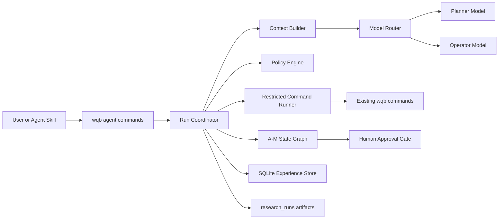

# WQB Quant Agent Design

Date: 2026-07-15

## 1. Purpose

Build a semi-autonomous quantitative research agent on top of `wqb-cli` for
WorldQuant BRAIN REGULAR FASTEXPR research. The agent autonomously selects or
accepts a research scope, gathers evidence, forms hypotheses, creates and
backtests candidates, diagnoses failures, and performs final checks. A human
must approve every formal Alpha submission.

The design applies six operating principles:

1. Manage context by preserving decisive facts and filtering irrelevant data.
2. Split work by business semantics and explicit node contracts.
3. Assign deterministic rules, model judgment, and human responsibility to
   different owners.
4. Route each task to the appropriate model, tool, or workflow node.
5. Preserve a failure trace that identifies the failed layer and next action.
6. Store successful and failed research as reusable structured experience.

## 2. Scope

### 2.1 Included in the first version

- REGULAR FASTEXPR Alpha research.
- Manual scope selection using `region`, `delay`, `universe`, and
  `neutralization`.
- Automatic scope selection using platform opportunities, account level gaps,
  and submission capacity.
- A deterministic A-M workflow coordinator with bounded F/G/H/I feedback
  loops.
- Separate Planner and Operator model roles.
- OpenAI and OpenAI-compatible model adapters behind one interface.
- Real simulation execution through existing `wqb` commands.
- Human approval before formal submission.
- Checkpoint recovery and external-call idempotency.
- A SQLite structured experience store.
- A thin Codex/Claude-style Skill that invokes the same agent CLI.
- Offline evaluation and optional explicitly enabled live smoke tests.

### 2.2 Not included in the first version

- REGULAR PYTHON or SUPER Alpha generation.
- Fully autonomous formal submission.
- Arbitrary shell or user-provided script execution by a model.
- Vector embeddings or a vector database.
- Online model training or automatic prompt optimization.
- A graphical user interface or hosted multi-user service.

## 3. Chosen Approach

Use a deterministic state graph for control and limited LLM decision nodes for
judgment. A free-form LLM tool loop is not used because `wqb-cli` operates real
APIs and has no dry-run branch. The coordinator owns state, budgets, command
allowlists, validation, recovery, and approval. Models can only return typed
decisions.



## 4. Components and Boundaries

### 4.1 Agent commands

`commands/agent.py` exposes the public CLI and delegates all behavior to the
agent package. It does not contain workflow logic.

Required commands:

- `wqb agent run`
- `wqb agent resume RUN_ID`
- `wqb agent status RUN_ID`
- `wqb agent approve RUN_ID`
- `wqb agent reject RUN_ID --reason TEXT`
- `wqb agent history`
- `wqb agent models list`
- `wqb agent models set ROLE`
- `wqb agent models test [ROLE]`
- `wqb agent eval`

Manual mode requires all four scope values. Automatic mode is explicit; manual
mode is the safer default. Starting a run authorizes real simulations within
the displayed budget, but never authorizes formal submission.

Example command shapes:

```powershell
wqb agent run --scope-mode manual --region USA --delay 1 `
  --universe TOP3000 --neutralization SUBINDUSTRY

wqb agent run --scope-mode auto

wqb agent status run_20260715_120000_quant
wqb agent approve run_20260715_120000_quant
```

### 4.2 Run Coordinator

`agent/coordinator.py` executes the A-M graph, creates node attempts, persists
checkpoints, and processes terminal outcomes. It does not call provider SDKs or
construct shell commands directly.

### 4.3 Policy Engine

`agent/policy.py` validates candidate operations before any model or platform
call. It owns:

- allowed state transitions;
- per-node command allowlists;
- scope locks;
- concurrency and total budgets;
- model-role permissions;
- expression and evidence validation requirements;
- approval requirements.

The policy engine can reject work but cannot silently repair or reinterpret a
model decision.

### 4.4 Context Builder

`agent/context.py` builds role- and node-specific context. It preserves node
rules, current scope, exact metrics, expressions, identifiers, and policy
limits verbatim. Long history is supplied as structured summaries plus stable
artifact or experience IDs. The model can request an identified original
artifact when a summary is insufficient.

### 4.5 Model Router and adapters

`agent/models/` defines a common typed interface and two role routes. The first
version includes:

- an OpenAI adapter;
- an OpenAI-compatible adapter with a configured API style;
- deterministic fake adapters for tests.

Provider-specific response objects are normalized before the coordinator sees
them. No provider SDK type crosses the adapter boundary.

### 4.6 Restricted Command Runner

`agent/runner.py` invokes the current package as an argument array, equivalent
to `python -m wqb_cli ...`, with no shell interpolation. It captures structured
JSON, exit status, timestamps, and output file paths. Each node has an explicit
allowlist. Existing command handlers remain the source of truth for BRAIN API
behavior. When `arxiv_cli` is installed, G may additionally invoke only its
documented read-only search commands through a separate fixed allowlist. If it
is unavailable, G records the missing paper source instead of inventing paper
evidence.

### 4.7 Persistence

`agent/store.py` uses `local/agent/agent.sqlite3`. Large and raw artifacts stay
under `research_runs/<run_id>/`; SQLite stores normalized records and artifact
references. Credentials and cookies are never stored in either location.

### 4.8 Agent Skill

The Skill is a thin interaction layer. It translates a conversational request
into `wqb agent run`, `status`, `resume`, `approve`, or `reject`. It cannot call
submission APIs directly and does not duplicate workflow rules.

## 5. Dual-Model Routing

Every model request declares one of two fixed roles.

### 5.1 Planner

The Planner uses the higher-capability model and owns decisions that can change
research direction:

- compare opportunities and choose an automatic scope;
- select the REGULAR tower;
- decide what evidence is missing;
- formulate the economic mechanism;
- produce and revise the research plan;
- define a candidate-generation strategy;
- diagnose failures and select F, G, H, or I as the next node;
- produce the final recommendation and risk summary.

Planner output is a versioned `ResearchPlan`. Its stable fields include scope,
goal, constraints, evidence requirements, operator tasks, success criteria,
stop criteria, version, and content hash.

### 5.2 Operator

The Operator uses the ordinary small model and performs bounded transformation
work:

- construct search parameters from a Planner task;
- organize data-field, community, and documentation results;
- check whether requested evidence is available;
- materialize FASTEXPR candidates from a `CandidatePlan`;
- organize simulation metrics and platform errors for Planner review.

The Operator receives one `task_id` and the minimum required context. It can
return a typed result or `BLOCKED`. It cannot change scope, budgets, success
criteria, route, plan version, or submission state.

### 5.3 Deterministic ownership

Neither model authenticates, executes commands, controls concurrency, decides
whether hard numeric thresholds passed, persists approval, or submits an Alpha.
Those actions remain deterministic.

### 5.4 Node allocation

| Nodes | Planner responsibility | Operator responsibility |
| --- | --- | --- |
| B-D | Compare opportunities and decide scope/tower | Organize candidate platform data |
| F-G | Decide missing evidence | Build searches and organize results |
| H | Form the mechanism and plan | Check required inputs |
| I | Define `CandidatePlan` | Build concrete FASTEXPR candidates |
| J | None | None; deterministic simulation execution |
| K | Diagnose and route | Organize metrics and anomalies |
| L | Final recommendation and risks | Organize checks and correlations |
| A, C, M | None where rules suffice | None where rules suffice |

### 5.5 Configuration and usage accounting

Planner and Operator configurations are independent and may use different
providers, endpoints, API styles, and models. Each role records calls, input and
output tokens, provider-reported cost when available, latency, retries, and
failures.

`wqb agent run --planner-model MODEL_ID --operator-model MODEL_ID` may override
the two configured model IDs for one run. The provider, endpoint, API style,
and secret reference still come from the selected role configuration, so a
model-ID override cannot redirect traffic or expose credentials.

Configuration is stored under the existing local config mechanism. API keys
are stored with the existing keyring mechanism and referenced by secret name.
A representative configuration shape is:

```json
{
  "agent": {
    "models": {
      "planner": {
        "provider": "openai",
        "model": "planner-model-id",
        "reasoning": "high",
        "secret_name": "agent-planner-api-key"
      },
      "operator": {
        "provider": "openai-compatible",
        "api_style": "chat_completions",
        "model": "operator-model-id",
        "base_url": "https://model-gateway.example/v1",
        "secret_name": "agent-operator-api-key"
      }
    }
  }
}
```

The identifiers and URL above are illustrative user-supplied configuration,
not shipped defaults.

There is no silent cross-role fallback. A Planner failure pauses the run. An
Operator may use only an explicitly configured Operator fallback model; it can
never promote itself to Planner.

## 6. Workflow and Data Flow

### 6.1 Scope selection

In manual mode, the coordinator validates the four supplied scope fields using
platform options and locks them for the run. B and C may still collect context,
but D cannot replace the scope.

In automatic mode, B and C gather platform opportunities, account level gaps,
and submission capacity. The Planner ranks only validated candidates. D locks
the selected REGULAR scope before field research begins.

### 6.2 A-M execution

| Node | Primary behavior |
| --- | --- |
| A | Verify authentication and pause as `NEEDS_AUTH` when required. |
| B | Gather platform opportunity and level-gap evidence. |
| C | Gather research direction and submission-capacity constraints. |
| D | Select and lock the REGULAR main tower. |
| F | Filter feasible data and fields using platform and local evidence. |
| G | Retrieve community, official, platform, and paper evidence. |
| H | Produce an evidence-backed economic mechanism and research plan. |
| I | Produce a validated, deduplicated FASTEXPR candidate set. |
| J | Execute bounded simulations using existing `wqb sim` commands. |
| K | Evaluate hard metrics, diagnose failures, and route to F/G/H/I or L. |
| L | Run slow checks, correlations, and final recommendation. |
| M | Record the terminal decision and submit only after bound approval. |

The existing hard REGULAR thresholds remain the default:

- Sharpe greater than 1.58;
- Fitness greater than 1;
- Turnover greater than 1 percent and less than 70 percent;
- Margin greater than 0.1 percent.

Node L also requires the platform checks and correlation constraints defined by
the existing workflow node document. Passing numeric thresholds alone is not a
submission recommendation.

### 6.3 Diagnosis routes

K emits exactly one typed diagnosis:

- `DATA_FIELD` routes to F;
- `EVIDENCE_GAP` routes to G;
- `ECONOMIC_MECHANISM` routes to H;
- `EXPRESSION` routes to I;
- `PASS` routes to L.

The coordinator rejects any other route. A global budget or no-progress stop
does not ask K to invent a route; it enters M in record-only finalization mode.
This bounded finalization deliberately supersedes the legacy instruction to
loop indefinitely before M.

### 6.4 Context records and citations

Context is split by semantic object rather than character count:

- node rules remain complete documents;
- API payloads become typed field, Alpha, Simulation, Check, and account
  records;
- community and documentation results remain complete entries;
- prior experiences remain complete structured records with artifact links.

Every model decision contains `decision`, `reasoning_summary`,
`evidence_refs`, `confidence`, and node-specific typed data. Evidence references
must resolve to a current-run artifact or experience record. Unsupported
decisions fail validation. Full private chain-of-thought is neither requested
nor stored.

### 6.5 Candidate deduplication

FASTEXPR strings are normalized using a syntax-aware representation before a
stable fingerprint is computed. Exact and normalized duplicates are blocked
before simulation. A run also checks the structured experience store to avoid
retesting known identical candidates in the same scope unless an explicit
policy allows revalidation.

## 7. State, Storage, and Recovery

### 7.1 Run states

The run state model includes:

- `CREATED`
- `RUNNING`
- `NEEDS_AUTH`
- `PAUSED_MODEL`
- `AWAITING_APPROVAL`
- `SUBMITTED`
- `REJECTED`
- `BUDGET_EXHAUSTED`
- `NO_PROGRESS`
- `FAILED`

Node progress is stored separately so a terminal outcome does not erase the
last completed A-M node.

### 7.2 SQLite records

The initial schema contains normalized tables for:

- runs and immutable run configuration;
- node attempts and state transitions;
- versioned research plans and operator tasks;
- model calls and per-role usage;
- command ledger entries;
- artifacts and evidence references;
- candidates and normalized expression fingerprints;
- simulations and Alpha identifiers;
- diagnoses and route decisions;
- approvals and terminal outcomes;
- reusable experiences.

Experience records capture scope, hypothesis, fields, operators, expression
fingerprint, settings, metrics, checks, failure class, route, final decision,
and source artifact IDs. Retrieval uses exact structured filters and ranking;
the first version does not embed text.

### 7.3 Command ledger and idempotency

Before an external call, the coordinator persists its normalized arguments and
idempotency fingerprint. After completion it stores the raw result, resource
IDs, and status.

- Completed calls are reused after resume.
- A created Simulation that later times out is resumed with `wqb sim get`.
- An uncertain submission is inspected through Alpha and submit-check APIs
  before any retry.
- A completed node is never re-entered unless a recorded K route creates a new
  attempt.

## 8. Budgets and Stop Conditions

Default limits are conservative and overridable per run:

- 8 candidates per round;
- 5 rounds;
- 40 total simulations;
- 8 concurrent non-GLB REGULAR simulations;
- 4 concurrent GLB REGULAR simulations;
- 180 minutes total runtime;
- 20 Planner calls;
- 100 Operator calls.

A monetary cap is enforced when the adapter can report usage and configured
pricing. Call-count and runtime limits always apply, so missing price metadata
cannot create an unbounded run.

The run stops when a candidate passes L, a hard budget is reached, or two
consecutive K cycles produce no new valid expression fingerprints. Budget and
no-progress stops create a final report containing the best failed candidates,
failure trace, consumed budget, and suggested next research direction.

## 9. Approval and Submission

Passing L sets `AWAITING_APPROVAL` and writes a final report. The approval
subject is the tuple of `run_id`, recommended `alpha_id`, and the SHA-256 hash
of the final report. A later report or candidate change invalidates approval.

`wqb agent approve RUN_ID` verifies the tuple and permits M to call the existing
submission command. `reject` records the reason and lets M finish without a
submission call. The Skill must use the same commands and has no bypass.

Submission is never retried blindly. API acceptance and final submit success
remain distinct, following current `wqb alpha submit` semantics.

## 10. Error Handling and Security

### 10.1 Errors

- Invalid model JSON receives schema feedback and at most two repair attempts.
- Model timeout and rate limiting follow the role's bounded retry policy.
- Planner exhaustion pauses the run; it never delegates to Operator.
- Operator `BLOCKED` returns the task to Planner for bounded replanning.
- Expired authentication sets `NEEDS_AUTH` and resumes after `wqb auth login`.
- Platform rate limits honor `Retry-After` and consume runtime budget.
- Candidate validation errors are recorded without an API call.
- Unknown state, command, field, operator, route, or plan version fails closed.

### 10.2 Security

- Models cannot execute a shell or supply a command name.
- Command arguments are typed and passed as an array without interpolation.
- Node allowlists are checked immediately before execution.
- Credentials, cookies, keyring values, and API keys are excluded from prompts,
  logs, artifacts, and SQLite.
- Retrieved community and historical text is untrusted evidence, not an
  instruction source.
- Fields, operators, settings, and Alpha identifiers are validated against
  current platform metadata before use.

## 11. Observability and Reports

Each node directory stores:

- `commands.jsonl` with normalized commands and ledger IDs;
- raw structured command outputs;
- `context_manifest.json` listing supplied evidence IDs;
- validated model request metadata and response objects;
- `node_summary.md`;
- failure and route records when applicable.

`wqb agent status` reports node, state, current plan version, scope, budgets,
Planner and Operator usage, recent failure, and next permitted action. The
final report lists candidates, metrics, checks, citations, route history,
costs, approval subject, and terminal outcome.

## 12. Testing and Evaluation

Tests are offline by default and use `FakePlanner`, `FakeOperator`,
`FakeCommandRunner`, and fixed WQB JSON fixtures.

### 12.1 Test layers

- Unit tests cover state transitions, budgets, fingerprints, schemas, context
  filtering, evidence resolution, and diagnosis routes.
- Contract tests cover both model adapters and conversion of existing `wqb`
  command JSON into internal types.
- Scenario tests cover manual and automatic scopes, success, each K route,
  budget exhaustion, no progress, authentication loss, rate limits, model
  failures, process interruption, resume, approval, and rejection.
- Security tests attempt Operator plan mutation, role escalation, arbitrary
  command execution, prompt injection, secret leakage, and pre-approval submit.
- Live tests require an explicit environment switch, a controlled account, and
  a small budget. Live tests never formally submit an Alpha.

### 12.2 Evaluation metrics

`wqb agent eval` returns JSON containing:

- candidate validity rate;
- citation coverage and invalid citation count;
- diagnosis route accuracy;
- duplicate avoidance rate;
- resume idempotency;
- pass-at-budget;
- budget violations;
- approval-gate violations;
- role-routing accuracy;
- blocked Operator privilege violations;
- Planner and Operator calls, tokens, cost, latency, and failure rate.

Budget and approval-gate violations must always be zero.

## 13. Acceptance Criteria

The first version is accepted when:

1. Manual and automatic scope modes both produce persistent runs.
2. Planner and Operator can use different configured providers and models.
3. Every model call is role-routed and every response is schema-validated.
4. Operator attempts to mutate a plan or route are rejected before side
   effects.
5. A successful fixture reaches `AWAITING_APPROVAL` and cannot submit before
   approval.
6. Approving the bound report permits exactly one submission workflow.
7. F, G, H, and I failure fixtures route to the expected node.
8. Budget and no-progress fixtures terminate with an actionable report.
9. Resume never recreates a Simulation whose resource ID was already recorded.
10. Secrets do not appear in model context, files, logs, or SQLite.
11. Structured experience from one run is retrieved by a matching later run.
12. `status`, `history`, and final reports explain decisions, citations, model
    role usage, real commands, and costs.
13. The offline test and evaluation suites pass without network access.
