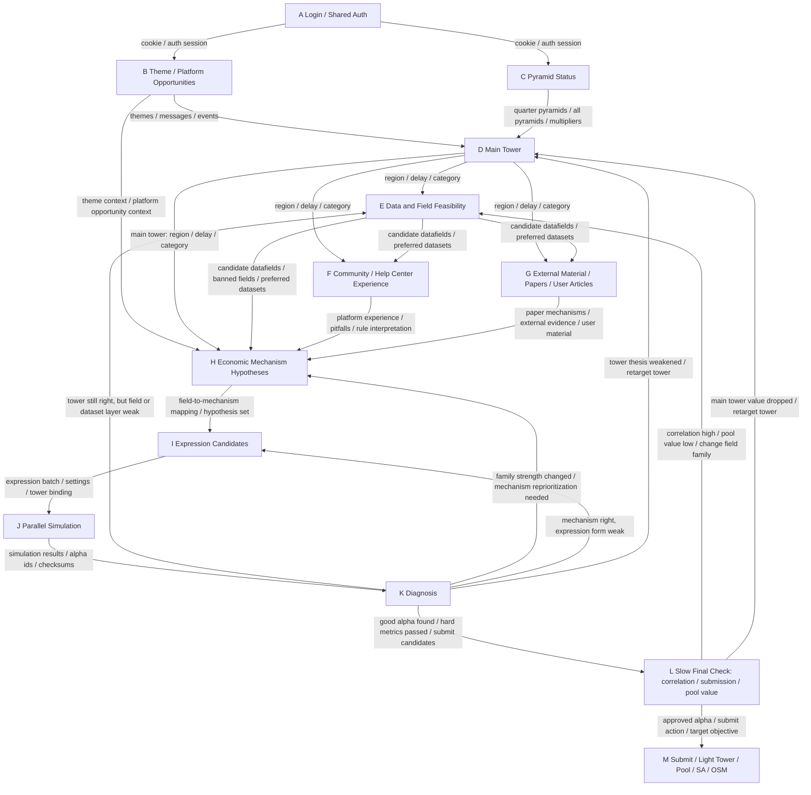

# Research Workflow Graph

This file is the current formal workflow graph for the WQB research process.

Goals:
- constrain agent research behavior with explicit nodes
- make each node's inputs, outputs, and success conditions clear
- make `E_data_and_field_feasibility` end at a reusable `candidate datafields` library

---

## Main Graph



---

## Current Node Coverage

Stable and already implemented:
- A
- B
- C
- D
- E
- F
- G
- H
- I
- J
- K
- L
- M

Current first stable endpoint:

```text
E outputs a reusable candidate datafields library
```

Current first stable research loop:

```text
H -> I -> J -> K
```

---

## Current Most Important Optimization Directions

1. Optimize `D -> E`
- whether main tower selection rules need finer prioritization
- whether non-fundamental category concentration rules should also be added

2. Optimize `E`
- whether candidate datafield ranking logic should be stronger
- whether more plugin-side analysis features should be used
- whether operator family / signal family diversity should be explicitly controlled

3. Clarify `F / G / H`
- internal community / help-center experience
- external papers / user-provided material
- economic mechanism formation
- how they jointly compress `E` candidate fields into a small set worth turning into expressions

4. Clarify `K` branch logic
- `K -> L`: at least one true good alpha
- `K -> H`: mechanism family priority changed after diagnosis
- `K -> I`: mechanism still right but expression structure is weak
- `K -> E`: field or dataset layer is crowded or weak
- `K -> D`: tower thesis weakened
- `K -> BEST_K_BRANCH`: a historical `K` in the same run dominates the current degraded path
  - action:
  - move all top-level node directories after that best `K` into `<best_K_dir>/error_branch/...`
  - continue from that best `K` inside the same run instead of creating a new run

---

## Notes

This is the current formal version of the workflow graph.

Future workflow changes should update this file first, then sync into the corresponding:
- `SKILL.md`
- `node.md`
- `run.bat`
