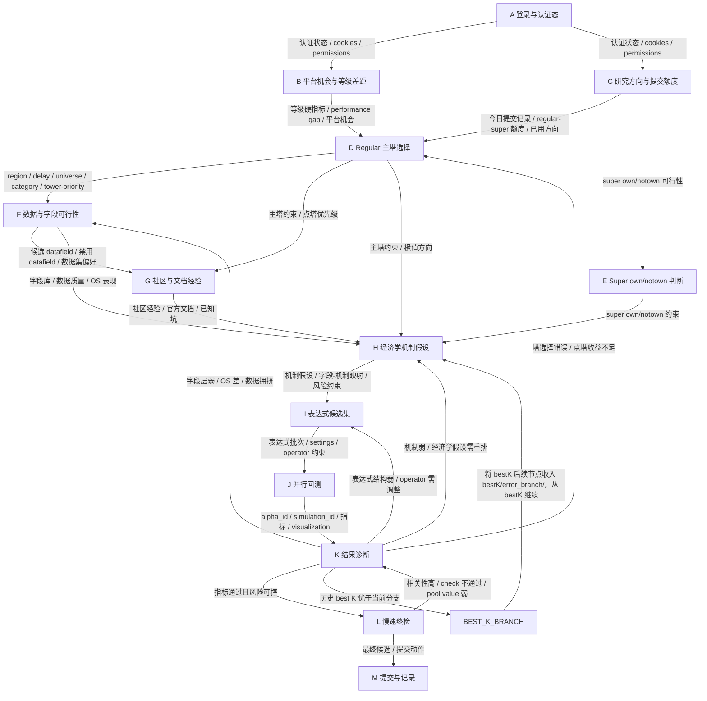

# WQB Research Workflow

本目录定义研究流程，不实现任何运行脚本。
所有节点只能调用 `wqb` CLI 或人工读取节点产物，不允许新增 `.py`、`.bat`、`.ps1` 等脚本来替代 CLI。

## 运行目录规则

每一轮研究必须在 `research_runs/` 下创建独立目录：

```text
research_runs/
  run_{YYYYMMDD_HHMMSS}_{agent_name}/
    01_A_auth_session/
    02_B_platform_opportunity/
    ...
    13_M_submit/
```

约束：

- `run_{时间戳}_{agent_name}` 的 `agent_name` 使用负责主循环的 agent 名称。
- 每个 node 只能写入自己的子文件夹。
- 每个 node 必须保存 `commands.md`、CLI 原始输出、`node_summary.md`。
- 需要传给下游的数据必须写入明确命名的 JSON 或 Markdown 文件。
- 不允许使用 workflow 内自建脚本；如果 CLI 不足，记录为 `cli_gap.md`，但本轮仍只能使用已有 `wqb` 命令推进。
- 在达到 `13_M_submit/` 前，agent loop 不允许因为 K 回退、BEST_K_BRANCH、指标未达标而停止；必须按图继续选择下一跳。

## 主图



## 硬性研究规则

- 点塔是第一优先级，overused data 不是第一优先级。
- Regular 硬指标：`sharpe > 1.58`、`fitness > 1`、`1% < turnover < 70%`、`margin > 0.1%`。
- CHN 和 D0 可以使用更高内部标准，但不能低于平台硬指标。
- E/F 字段筛选优先级：OS 效果差的数据不用；已使用 datafield 硬排除；已使用 dataset 尽量不用。
- I 必须遵守 operator 参数规范，特别是字符串单引号和不可省略参数。
- J 回测并发规则：REGULAR 非 GLB 最多 8 槽，REGULAR GLB 最多 4 槽，SUPER 最多 3 槽；FASTEXPR multi 建议非 GLB 每批 10 条，GLB 每批 5 条。
- K 诊断必须读取 visualization 结果；没有 visualization 的结果只能作为弱证据。
- K 不得只看 child alpha id，必须记录真实 `alpha_id` 及完整指标。
- 到达 M 前不允许停下来问用户；按本图自动选择下一跳。

## 节点文件

每个节点的详细输入、输出和 CLI 调用约束见：

```text
workflow/nodes/{节点名}/node.md
```

## 规则修正：点塔定义

- 当前季度塔数据必须来自带 `startDate/endDate` 的 `wqb user pyramid-alphas`，不能使用无参全量历史塔判断当前季度。
- 点亮塔的硬定义：当前季度某个 `region / delay / category` 的 `alphaCount >= 3`。
- `alphaCount = 0`、`alphaCount = 1`、`alphaCount = 2` 都视为未点亮或未补足。
- D 节点选择 Regular 主塔时，必须优先考虑当前季度 `alphaCount < 3` 的 D1 塔。
- D 节点排序优先级：补足点塔缺口优先，其次 multiplier，其次可做性和 performance 提升；overused data 不高于点塔优先级。
- `main_tower.json` 必须记录当前塔的 `alphaCount` 和 `neededToLight = max(0, 3 - alphaCount)`。
## 硬规则：严禁混信号

- 严禁用线性加权把多个不同经济机制拼成一个 alpha，例如 `0.532 * stable + 0.208 * revision + 0.136 * reversal + 0.104 * liquidity + 0.020 * volatility`。
- 一个 alpha 只能有一个主经济机制，表达式必须围绕该机制构建。
- 允许的辅助项只限于同一机制内部的标准化、去极值、缺失值处理、行业/组内中性化、衰减或单一风险门控；辅助项不能成为独立收益来源。
- 目标塔是什么，主信号就必须来自该塔 category。禁止用其他 category 的强信号加少量目标塔字段来蹭 pyramid 分类。
- 如果目标塔主字段连续失败，K 必须回 D/F/H 重新选择塔、字段或机制；禁止通过混入 PV、MODEL、LIQUIDITY、VOLATILITY 等其他强信号硬凑指标。
- I 节点生成候选时必须在 `operator_constraints_check.md` 或候选说明中标注 `single_mechanism=true`，并解释为什么不是混信号。
