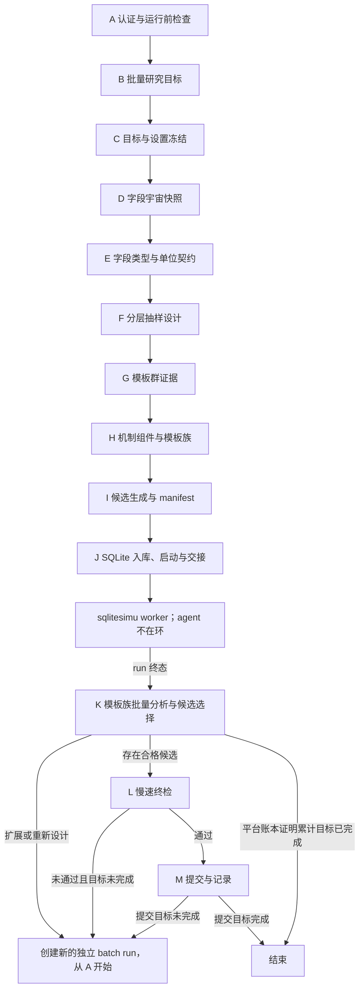

# WQB Research Workflow: BatchSimu

本流程用于模板群的分层筛选、扩展、终检与提交。A-I 由 agent 构建一次性、可复现的候选 manifest；J 将 manifest 入库并启动 `wqb sqlitesimu` worker；worker 运行期间 agent 不参与逐条发起回测、轮询、重试或结果修补；只有 run 到达终态后才能进入 K/L/M。

本目录自包含 A-M 的全部输入输出契约。节点不得读取其他研究流程的节点目录，也不存在跨流程跳转或 handoff。K 选出的 Alpha 必须在本 run 的 L/M 中完成终检与提交，禁止转移到其他流程。

模板源码、candidate lineage 和结果报告统一遵循本目录的 `template_contract.md`；节点文档若与该契约冲突，以该契约为准并停止执行，禁止临时兼容。

## 运行目录

```text
research_runs/
  workflow_batchsimu/
    run_{YYYYMMDD_HHMMSS}_{agent_name}/
      run_manifest.json
      01_A_auth_preflight/
      02_B_batch_objective/
      03_C_target_settings/
      04_D_field_universe/
      05_E_field_contracts/
      06_F_allocation_design/
      07_G_template_evidence/
      08_H_mechanism_components/
      09_I_template_candidates/
      10_J_sqlite_batch/
      11_K_family_analysis/
      12_L_slow_final_check/
      13_M_submit/
```

`run_manifest.json` 必须在 A 创建，并固定：

- `workflow_type = "workflow_batchsimu"`
- `alpha_submission_allowed = true | false`，必须由 A 按本轮用户授权显式冻结
- `submission_target`，仅在允许提交时为正整数
- `authoritative_run = true | false`
- `source_workflow_graph`
- `started_at`

每个节点只写自己的目录。J 的 `simulations.sqlite3` 是本 run 唯一执行账本，不得与其他 run 共用可写数据库。

## 主图



## 阶段闸门

1. A-F 未完成时，G 不得定义模板族。
2. G/H 未提供证据、字段角色、placeholder contract、版本/epoch 和对称性规则时，I 不得生成 expression。
3. I 的 `template-validate` 未通过，或 lineage/hash/去重索引不一致时，J 不得 enqueue。
4. J 启动 worker 后只写交接信息；不得按单条结果自适应修改 manifest。
5. run 非终态时，K 不得计算密度、质量排名或相关性聚类。
6. K 未生成固定三段报告并完成 execution、quality、IS-PnL 三层分析时，不得选择提交候选或制定下一批次。
7. L 必须对 K 选出的本 run 真实 `alpha_id` 完成全部慢速 check、年度稳定性、self/prod correlation 和 pool 价值检查；任一必需项失败或 inconclusive 时不得进入 M。
8. M 只能处理 L 的 `submission_candidates.json`，且只在 run manifest 明确允许提交、额度可用时调用 `wqb alpha submit`。
9. `CANCELLED` 只能进入描述性 K。`BLOCKED` 若仅由已隔离的 `SIMULATE_UNKNOWN` 引起，且 READY coverage 达到 F 的预注册门槛，可分析 READY 子集；unknown 本身永远不重跑、不选择、不提交。
10. 已授权的 campaign 在平台确认累计提交目标前不得因弱结果、空候选、暂时无额度或单 run 预算耗尽而结束；这些状态只能创建新 batch、等待额度或由用户显式取消。

## 选区建议

`CHN` 因当前 Sharpe 门槛高于 `2.07`、`USA` 因研究拥挤而降低优先级。该建议只用于 B/C 的证据权衡，不是阶段闸门；有充分的实时 tower、倍率或机会及数据证据时仍可选择，`template-validate` 不按 region 拒绝 manifest。

## 模板群硬规则

- 模板群是带 lineage 的参数化 expression family，不是固定表达式列表。
- H 的参数化模板与 I 的已实例化 expression 是两个 artifact；I 不得丢失模板 header、version、epoch 或字段角色。
- 初筛采用各族等额、固定 seed、无放回抽样；候选总数由族数与有效族内样本数决定，不预设必须为 5000。
- 社区中 `30` 个族各抽约 `80` 条、再集中扩展少数高密度族，是实验设计参考，不是无需论证的常量。
- family 必须包含数据清理或 reduction、一个有经济含义的核心比较关系，以及有证据时才加入的约束性细节；只换 `rank/scale/zscore` 外层包装不构成新 family。
- unary/binary/ternary 按唯一字段数定义，不按 operator 嵌套层数定义；多字段只能服务同一个机制。
- 禁止正负孪生、可交换参数重复、反对称关系反向重复、等价 AST、混合独立收益机制和未支持 operator。
- expression 唯一不代表 PnL 独立；扩展前必须使用实际 IS-PnL 路径做相关性聚类。
- 一个权威 run 只能有一个 settings cell。不同 region、delay、universe 或其他关键设置必须使用不同 run。
- 诊断、canary 和已退役 run 不得混入权威 run 的 family denominator。
- simulation 请求只称为 simulate；submit 仅指 M 的 `wqb alpha submit` 入库动作。
- 本流程可以在 M 提交 Alpha，但只能提交本流程自己的 J/K/L 产物，不得接收或移交其他流程的 candidate、alpha 或检查结果。

## Worker 与终态

run 终态为 `COMPLETED`、`COMPLETED_WITH_ERRORS`、`BLOCKED` 或 `CANCELLED`。experiment 终态为 `READY`、`PERMANENT_FAILURE`、`SIMULATE_UNKNOWN` 或 `CANCELLED`。

`CANCELLED` 只具备描述性统计资格。`BLOCKED` 通常表示存在 `SIMULATE_UNKNOWN`：K 必须保留全部 assigned denominator，将 unknown 逐条隔离；只有 READY coverage 达到 F 的预注册门槛且其余完整性条件成立时，才可从 READY 子集生成 `best_alpha_candidates.json`。unknown 永远不得进入候选清单。

worker 运行时禁止持续打印日志。监控只读取 `wqb sqlitesimu status` 的紧凑计数；只有 worker 异常退出时才读取末尾少量错误摘要。

## 节点文件

```text
workflows/workflow_batchsimu/nodes/{node_name}/node.md
```
