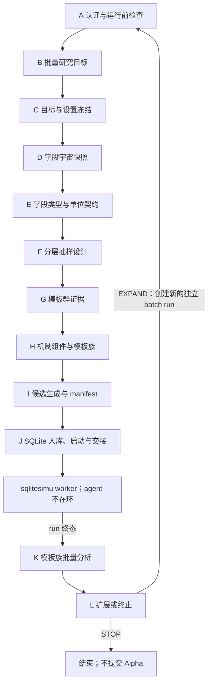

# WQB Research Workflow: BatchSimu

本流程用于模板群的分层筛选与扩展。A-I 由 agent 构建一次性、可复现的候选 manifest；J 将 manifest 入库并启动 `wqb sqlitesimu` worker；worker 运行期间 agent 不参与逐条提交、轮询、重试或结果修补；只有 run 到达终态后才能进入 K/L。

本目录自包含 A-L 的全部输入输出契约。节点不得读取其他研究流程的节点目录，也不存在跨流程跳转或 handoff。

## 运行目录

```text
research_runs/
  workflow_batchsimu/
    run_{YYYYMMDD_HHMMSS}_{agent_name}/
      run_manifest.json
      01_A_auth_preflight/
      02_B_batch_objective/
      03_C_target_settings/
      04_D_field_universe/
      05_E_field_contracts/
      06_F_allocation_design/
      07_G_template_evidence/
      08_H_mechanism_components/
      09_I_template_candidates/
      10_J_sqlite_batch/
      11_K_family_analysis/
      12_L_expansion_decision/
```

`run_manifest.json` 必须在 A 创建，并固定：

- `workflow_type = "workflow_batchsimu"`
- `alpha_submission_allowed = false`
- `authoritative_run = true | false`
- `source_workflow_graph`
- `started_at`

每个节点只写自己的目录。J 的 `simulations.sqlite3` 是本 run 唯一执行账本，不得与其他 run 共用可写数据库。

## 主图



## 阶段闸门

1. A-F 未完成时，G 不得定义模板族。
2. G/H 未提供证据、字段角色和对称性规则时，I 不得生成 expression。
3. I 的机器校验未通过时，J 不得 enqueue。
4. J 启动 worker 后只写交接信息；不得按单条结果自适应修改 manifest。
5. run 非终态时，K 不得计算密度、质量排名或相关性聚类。
6. K 未完成 execution、quality、IS-PnL 三层分析时，L 不得扩展。

## 模板群硬规则

- 模板群是带 lineage 的参数化 expression family，不是固定表达式列表。
- 初筛采用各族等额、固定 seed、无放回抽样；候选总数由族数与有效族内样本数决定，不预设必须为 5000。
- 社区中 `30` 个族各抽约 `80` 条、再集中扩展少数高密度族，是实验设计参考，不是无需论证的常量。
- family 必须包含数据清理或 reduction、一个有经济含义的核心比较关系，以及有证据时才加入的约束性细节；只换 `rank/scale/zscore` 外层包装不构成新 family。
- unary/binary/ternary 按唯一字段数定义，不按 operator 嵌套层数定义；多字段只能服务同一个机制。
- 禁止正负孪生、可交换参数重复、反对称关系反向重复、等价 AST、混合独立收益机制和未支持 operator。
- expression 唯一不代表 PnL 独立；扩展前必须使用实际 IS-PnL 路径做相关性聚类。
- 一个权威 run 只能有一个 settings cell。不同 region、delay、universe 或其他关键设置必须使用不同 run。
- 诊断、canary 和已退役 run 不得混入权威 run 的 family denominator。
- 本流程不直接提交 Alpha。

## Worker 与终态

run 终态为 `COMPLETED`、`COMPLETED_WITH_ERRORS`、`BLOCKED` 或 `CANCELLED`。experiment 终态为 `READY`、`PERMANENT_FAILURE`、`SUBMIT_UNKNOWN` 或 `CANCELLED`。

`BLOCKED` 和 `SUBMIT_UNKNOWN` 虽是终态，但不自动具备统计资格。K 必须先判断 denominator 是否完整、POST 不确定性是否污染结果，再决定只能停止、重跑，还是可以作受限分析。

worker 运行时禁止持续打印日志。监控只读取 `wqb sqlitesimu status` 的紧凑计数；只有 worker 异常退出时才读取末尾少量错误摘要。

## 节点文件

```text
workflows/workflow_batchsimu/nodes/{node_name}/node.md
```
