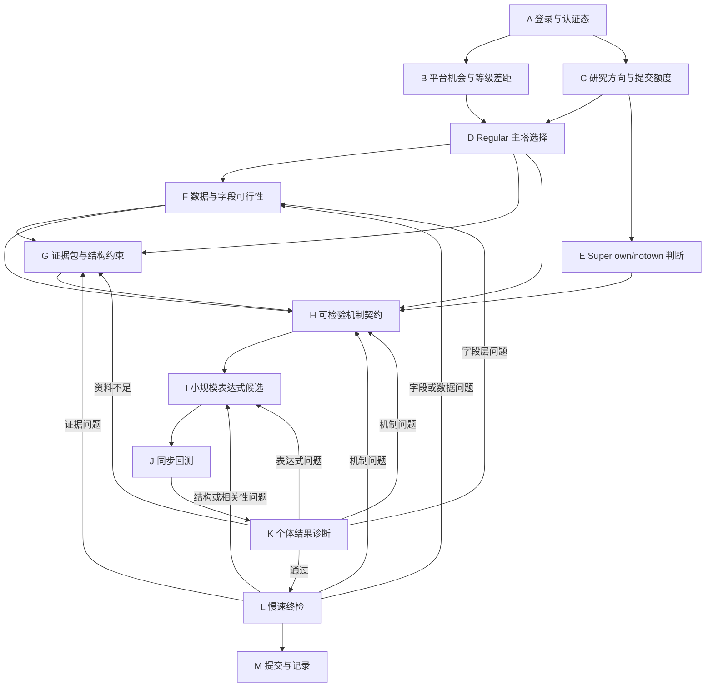

# WQB Research Workflow: Simu

本流程用于少量、可自适应的表达式研究。agent 会读取每轮个体结果并决定下一轮，所有控制流都在本目录定义的 A-M 节点内闭环。

所有节点只允许在WQBRAIN conda环境调用 `wqb` CLI，或人工读取节点产物；不允许新建 `.py`、`.bat`、`.ps1` 等脚本来替代 CLI。

## 运行目录规则

每一轮研究必须在 `research_runs/` 下创建独立目录：

```text
research_runs/
  workflow_simu/
    run_{YYYYMMDD_HHMMSS}_{agent_name}/
      01_A_auth_session/
      02_B_platform_opportunity/
      ...
      13_M_submit/
```

run 根目录必须包含 `run_manifest.json`，其中 `workflow_type` 固定为 `workflow_simu`。

约束：
- 每个 node 只写自己的子目录
- 每个 node 运行时都要在 WQBRAIN conda环境调用 `wqb` CLI
- 每个 node 运行时都要在 `workflows/workflow_simu/nodes` 目录下读一遍对应节点的 `node.md` 文件
- 每个 node 必须保存 `commands.md`、原始输出、`node_summary.md`
- 到达 `M` 前 agent loop 不允许停止

## 主图



## 硬规则

- 点塔优先级高于 overused data
- Regular 硬指标：
  - `sharpe > 1.58`
  - `fitness > 1`
  - `1% < turnover < 70%`
  - `margin > 0.1%`
- F 字段筛选优先级：
  - OS 差的数据不用
  - 已使用 `datafield` 硬排除
  - 已使用 `dataset` 尽量不用
- I/J 规模和并发规则：
  - 每轮必须在 I 声明候选上限，默认不超过 `50`
  - Regular 非 `GLB` 最多 `8` 槽
  - Regular `GLB` 最多 `4` 槽
  - Super 最多 `3` 槽
- K 必须读 visualization 结果；没有 visualization 的结果只能作弱证据
- K 必须记录真实 `alpha_id` 与完整结果，不能只看 child alpha id
- K 必须区分平台、语法、数据、单位和经济表现失败，不能把执行错误解释为机制失败

## G 节点硬规则

G 必须同时完成：
- 本地社区库搜索
- 官方文档搜索
- 平台资料搜索
- 相关论文或研报搜索

G 只输出证据与结构约束，不生成表达式或回测参数。

如果环境里存在 `arxiv_cli`，必须优先使用：

```powershell
python -m arxiv_cli --help
python -m arxiv_cli search --help
python -m arxiv_cli search query --help
python -m arxiv_cli ...
```

## K 节点硬规则

如果 K 没有决定进入 `L/M`，则必须回退，而且：
- 回退节点必须由 K 自行判断
- 不允许停下来问用户
- 回退节点只能从 `[F, G, H, I]` 中选

本流程只对 I 本轮的有界候选做个体诊断，不计算模板族有效密度，也不依据大量参数变体选择结构。

## 节点文件

每个节点的详细输入、输出和 CLI 约束见：

```text
workflows/workflow_simu/nodes/{节点名}/node.md
```
