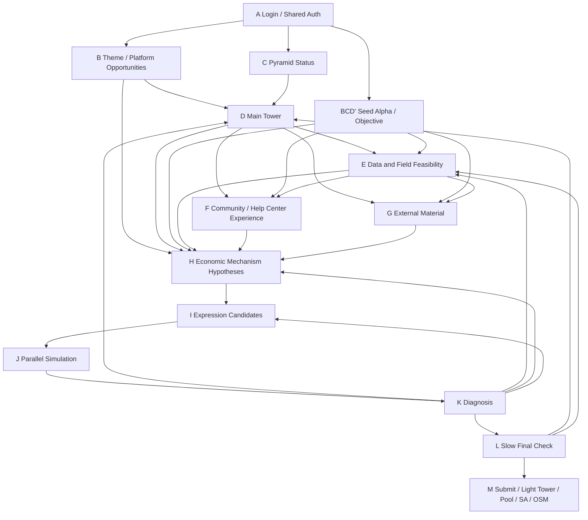

# WQB Research Workgraph

This is the agent-controlled research workgraph for WQB runs.
This variant is for REGULAR alphas.
REGULAR alphas may use `settings.language = "FASTEXPR"` or `settings.language = "PYTHON"`.
It is separate from the existing `workflow/` implementation.
Do not delete or rewrite `workflow/` when changing this workgraph.
Do not adapt or call `workflow/nodes/*/run.bat` from this workgraph.
New regular nodes live under `workgraph/regular/nodes/*/NODE.md`.

## Research Objective

The graph is not a one-off alpha factory.
Its regular-alpha objective is to build a repeatable research loop that improves the user's consultant trajectory toward:

- high Value Factor / VF through recent alpha quality, diversity, and uniqueness
- higher weight through durable, distinctive, low-correlation contributions
- Grand Master readiness through combined performance, pyramid coverage, and tie-breaker discipline

Community evidence must be treated as objective context, not decoration.
Node F must prioritize high-VF, high-weight, and Grand Master forum evidence before generic tower-specific hints, then hand actionable implications to H/I/J.

## Runtime Root

Every workgraph run writes only inside one directory:

```text
research_runs/run_YYYYMMDD_HHMMSS/
```

No workagent or nodesubagent may create, edit, or delete files outside the active run directory while the graph is running.
The only exception is editing tracked workgraph source files when explicitly developing the workgraph itself, not during a research run.

## Agent Roles

### Workagent

The workagent is the only coordinator.
It owns:

- creating the run directory
- assigning step numbers
- selecting the next node from graph state
- writing `graph_state.json`
- deciding graph branches after node completion
- stopping the run when a node blocks

The workagent must not ask a nodesubagent to decide the next graph branch.
The workagent must not execute node work itself.
It must spawn or assign a nodesubagent for every node, then supervise that nodesubagent's files.

### Nodesubagent

A nodesubagent executes exactly one node.
It receives:

- the active run directory
- one node id
- one node directory
- `node_input.json`
- the node contract

It may write only inside its assigned node directory.
It must produce the full output bundle in `workgraph/regular/node_output_contract.md`, including detailed process and handoff files.
It must not run later nodes, change `graph_state.json`, or edit any source file.

## Required Run Files

```text
research_runs/run_YYYYMMDD_HHMMSS/
  run_manifest.json
  graph_state.json
  commander_log.md
  nodes/
    01_A_login_shared_auth/
      node_input.json
      node_result.json
      outputs/
```

## Node Result Contract

Every node must write `node_result.json`:

```json
{
  "node_id": "E_data_and_field_feasibility",
  "status": "success",
  "blocking_reason": null,
  "next_recommendation": null,
  "outputs": {
    "available_datafields": "outputs/available_datafields__USA_D1_ANALYST.json"
  },
  "constraints_checked": {
    "write_scope_only_node_dir": true,
    "used_required_inputs": true
  },
  "notes": []
}
```

Allowed `status` values:

- `success`
- `blocked`
- `degraded`
- `failed`

`blocked` means the workagent should stop or branch before continuing.
`degraded` means the node produced a valid artifact but with missing optional evidence, such as an external data source timeout.

## Main Graph



## Seed Alpha Shortcut

When the user provides a specific `alpha_id` and an optimization objective, the workagent may schedule `BCD_prime_seed_alpha_objective` after A.
This node replaces B, C, and D for that run.
It must produce `outputs/decision.json` as the D-equivalent target tower decision and `outputs/seed_context.json` for seed-aware mechanism building.
Downstream nodes should treat the run as seed-alpha optimization rather than broad tower discovery.

## First Hard Rules

1. D is mandatory before E/F/G/H.
   - Exception: `BCD_prime_seed_alpha_objective` may replace B/C/D when the user supplies `alpha_id` and `optimization_objective`.
2. E must block when the candidate datafield pool is empty unless the workagent explicitly branches back to D.
3. I must only use fields present in E outputs.
4. G must degrade, not fail, when external sources time out.
5. J must support bounded runs; a timeout must produce a resumable `node_result.json`.
6. M defaults to review mode; live submission requires an explicit user instruction.
7. PYTHON candidates must follow `workgraph/regular/python_alpha_contract.md`.
8. SUPER candidates are out of scope for this graph and belong under `workgraph/super/` later.
9. F must search high-VF, high-weight, and Grand Master forum evidence first, then D/E/BCD'-specific experience.
